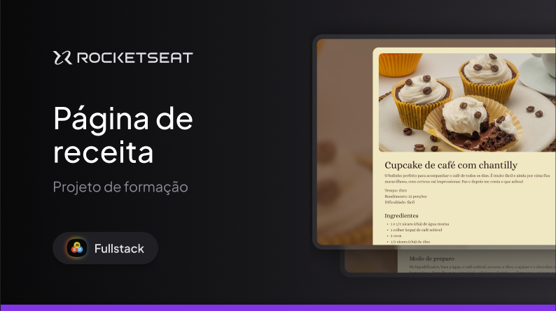
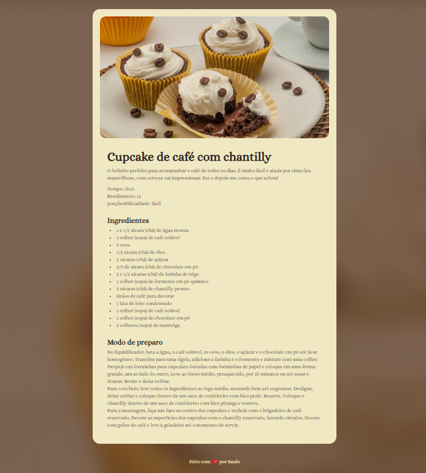

  <h1 align="center">Página de receita - Rocketseat Fullstack :rocket: </h1>

  

___

## 💻 Sobre
Nesse projeto foi desenvolvido uma página simples de receita.
Esse é um dos projetos desenvolvidos em aula na formação Full-stack, um de nossos conteúdos de especialização.
___

## 🎨 Layout

  

___

## 🛠 Tecnologias

As seguintes tecnologias foram empregadas na criação deste projeto:

- HTML
- CSS
___
